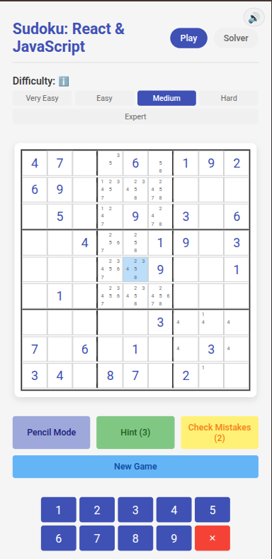

# Sudoku App

**[Play Sudoku Online](https://https://agsafronenko.github.io/Sudoku/)**

## Overview

Sudoku App is a modern, interactive Sudoku game and solver built with React and JavaScript. It features both a gameplay mode with multiple difficulty levels and a solver mode that can solve any valid Sudoku puzzle.

### Responsive Design
The Sudoku App is fully responsive, ensuring a seamless experience across all devices—from desktops to tablets and mobile phones. The layout and controls adapt dynamically to different screen sizes, making it easy to play or solve Sudoku puzzles on the go.



## Features

### Game Mode
- Multiple difficulty levels (Very Easy, Easy, Medium, Hard, Expert)
- Hint system with limited hints based on difficulty
- Note-taking mode for planning your moves
- Check for incorrect cells with limited checks based on difficulty
- Keyboard navigation and input support
- Animations for cell selection, number input, new game and game completion
- Sound effects with mute option

### Solver Mode
- Input any Sudoku puzzle to solve
- Automatic validation to ensure the puzzle is solvable
- Quick solving with the efficient backtracking algorithm
- Clear visual presentation of the solution
- Animations for cell selection, number input, new puzzle board and puzzle solution

## Controls

### Game Mode
- **Mouse**: Click cells to select, click numbers to input
- **Keyboard**:
  - **1-9**: Input numbers
  - **Delete/Backspace**: Clear selected cell
  - **Arrow Keys**: Navigate the board
  - **P**: Toggle pen/pencil (note) mode
  - **H**: Get a hint (if available)
  - **C**: Check for incorrect cells (if available)
  - **N**: Start a new game

### Solver Mode
- **Mouse**: Click cells to select, click numbers to input
- **Keyboard**:
  - **1-9**: Input numbers
  - **Delete/Backspace**: Clear selected cell
  - **Arrow Keys**: Navigate the board
  - **N**: Clear the board

## Technical Structure

The app is built with a clean architecture that separates concerns:

### Components
- `GameBoard`: Main component for game mode
- `SolverPage`: Main component for solver mode
- `Cell`: Individual cell rendering with highlighting
- `Controls`: Game controls UI
- `NumberPad`: Input pad for numbers
- `Modal`: Reusable modal for game messages
- `DifficultySelector`: Difficulty level selection

### Custom Hooks
- `useBoardState`: Manages the Sudoku board state
- `useInputHandler`: Handles user input logic
- `useKeyboardInput`: Manages keyboard interactions
- `useModal`: Controls modal state and actions
- `useAnimations`: Manages board animations

### Utilities
- `sudokuGenerator.js`: Generates random Sudoku puzzles
- `sudokuSolver.js`: Solves Sudoku puzzles using backtracking
- `soundUtils.js`: Manages sound effects

## Installation

```bash
# Clone the repository
git clone https://github.com/agsafronenko/Sudoku

# Navigate to the project directory
cd Sudoku

# Install dependencies
npm install

# Start the development server
npm start
```

## Usage

After starting the app, you can:

1. Choose between "Play" and "Solve" modes
2. In Play mode, select a difficulty level to start a new game
3. In Solve mode, input your puzzle and click "Solve"

## Technologies Used

- React (Hooks)
- JavaScript
- CSS3 (with animations)
- Audio APIs for sound effects

## Acknowledgments

- Inspired by classic Sudoku games and modern web app design
